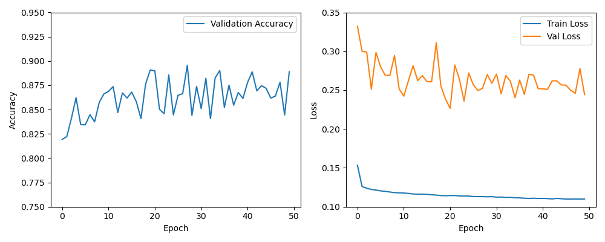
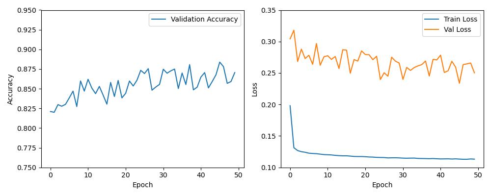
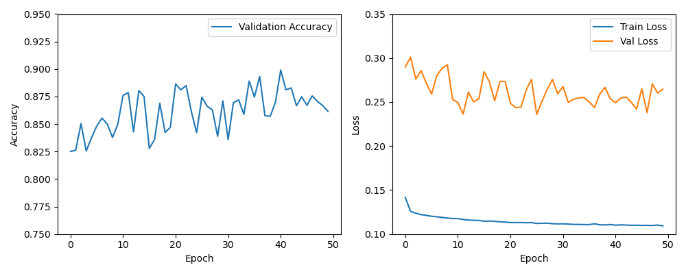

# RNN-Based Network Intrusion Detection

This repository provides supplementary material for the paper:

**Milan Balabanović**, *Evaluating the Effectiveness of AI-Based Network Intrusion
Detection Systems Compared to Traditional Approaches* (2025).

It contains the implementation, experimental configurations, and visual results used
to support the findings presented in the paper.

---

## Motivation
Traditional rule-based Network Intrusion Detection Systems (NIDSs), such as Snort,
are effective at detecting known attack signatures but show limited adaptability to
novel and evolving threats. The motivation of this work is to evaluate whether a
deep-learning–based NIDS, implemented using a Recurrent Neural Network (RNN) with
Long Short-Term Memory (LSTM) units, can provide improved detection performance and
reduced false positive rates.

---

## Methodology (Summary)
Experiments were conducted using the UNSW-NB15 dataset. Network traffic was
preprocessed through data cleaning, normalization, and one-hot encoding of
categorical features.  
An LSTM-based RNN was trained using supervised learning with a 70/30 train–test
split. Three different hyperparameter configurations were evaluated, all trained for
50 epochs to ensure a consistent basis for comparison.

---

## Results
All evaluated configurations achieved high detection rates (TPR > 98%). The most
balanced configuration reached 88.90% accuracy with a False Positive Rate of 22.52%,
outperforming the traditional rule-based NIDS Snort across all evaluated metrics.

The following figures illustrate the training and validation behavior for each model
configuration.



**Figure 1:** Training and validation accuracy and loss (Configuration 1).



**Figure 2:** Training and validation accuracy and loss (Configuration 2).



**Figure 3:** Training and validation accuracy and loss (Configuration 3).

---

## Contents
- `model_conf_*.py` – RNN model configurations  
- `conf_*.png` – Training and validation plots  
- `results.txt` – Quantitative performance metrics

## How to Run
The experiments can be reproduced by running the provided model configuration
scripts. Each script corresponds to one of the evaluated RNN configurations
described in the paper.

### Requirements
- Python 3.9+
- PyTorch
- pandas
- scikit-learn
- matplotlib

### Execution
1. Clone the repository:
   ```bash
   git clone https://github.com/MilanBalabanovic/Scientific-Writing.git
   ```
2. Navigat the repository:
   ```bash
   cd Scientific-Writing
   ```
3. Install dependecies:
   ```bash
   pip3 install requiremets.txt
   ```
4. Run desired configuration:
   ```bash
   python3 model_conf_#.py
   ```
